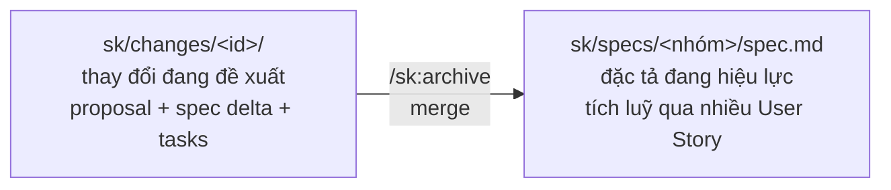

# SimplifyKit (`sk`)

Bộ lệnh cho Claude Code giúp bạn đi từ **một User Story trên Azure DevOps** đến code đã xong, mà không phải viết lại yêu cầu lần thứ hai.

Bạn đưa nó mã work item. Nó đọc acceptance criteria từ board, viết ra bản đặc tả và danh sách việc cần làm, bạn xem lại, rồi nó làm. Những gì nó viết ra đều là file markdown nằm trong repo — review được trên PR như mọi thay đổi khác.

## Khái niệm cốt lõi

SimplifyKit tách rời hai thứ: một **bản đặc tả sống lâu dài**, ghi hệ thống hôm nay phải làm gì; và một **thay đổi đang đề xuất**, chỉ ghi phần chênh lệch mà một User Story mới thêm vào. Tới khi bạn duyệt xong, thay đổi mới gộp vào đặc tả. Mô hình specs/changes này gần với OpenSpec — khác ở chỗ đầu vào luôn là một work item Azure DevOps thật, không phải một đề xuất người dùng tự viết từ đầu:



**Spec** là nguồn sự thật, viết bằng **Requirement** — một cam kết ("hệ thống SHALL ..."). SHALL là từ khoá cố định nghĩa là "phải", viết hoa theo lối đặc tả kỹ thuật kiểu RFC/OpenSpec: câu nào có SHALL là chắc chắn một cam kết kiểm chứng được, không lẫn với câu mô tả suông — nên công cụ, và cả Claude khi đọc lại spec sau này, cứ nhìn từ khoá là nhận ra Requirement, không phải đoán ý. Mỗi Requirement có một hoặc nhiều **Scenario**: một ví dụ quan sát được, viết theo cặp WHEN/THEN — WHEN nêu chuyện gì xảy ra, THEN nêu điều quan sát được sau đó (thêm GIVEN khi có tiền đề, AND khi có thêm hệ quả). Ví dụ:

> Requirement: hệ thống SHALL cho phép lọc sản phẩm theo màu.
> Scenario: **WHEN** người dùng chọn màu đỏ, **THEN** chỉ hiện sản phẩm màu đỏ.

Requirement không có Scenario là một ước muốn; Scenario không ai kiểm được là văn xuôi. Ví dụ đầy đủ nằm ở mục "Các file trong `sk/` nghĩa là gì" bên dưới. Quy tắc đầy đủ nằm ở [`plugins/sk/reference/conventions.md`](plugins/sk/reference/conventions.md) — gồm: mỗi Requirement chỉ một câu SHALL, Scenario phải quan sát được, và GIVEN chỉ xuất hiện khi có tiền đề đáng kể.

**Change** không sửa spec trực tiếp. Nó viết một **delta** — khối `## ADDED Requirements` / `## MODIFIED Requirements` / `## REMOVED Requirements`, mô tả *chênh lệch* so với spec hiện tại, không phải toàn bộ hệ thống. `/sk:archive` áp delta đó: `ADDED` thêm Requirement mới, `MODIFIED` **thay nguyên khối** Requirement cùng tên (nên phải chép lại cả Scenario không đổi — chi tiết ở "Có một quy tắc bạn cần nhớ" bên dưới), `REMOVED` xoá hẳn.

| Thuật ngữ | Nghĩa |
|---|---|
| **Spec** | Đặc tả đang hiệu lực, tích luỹ qua nhiều User Story đã archive |
| **Change** | Một thay đổi đang đề xuất — `proposal.md` + spec delta + `tasks.md`, sống riêng cho tới khi archive |
| **Requirement** | Một cam kết: hệ thống SHALL làm gì |
| **Scenario** | Một ví dụ quan sát được của Requirement |
| **Delta** | Phần spec trong một change, khai bằng ADDED/MODIFIED/REMOVED — chênh lệch, không phải bản đầy đủ |
| **Nhóm** (capability) | Một lát hành vi người đọc nhận ra ngay là một thứ, ví dụ `field-selector` — không phải một layer hay một sprint |
| **Proposal** | `proposal.md` — tóm tắt yêu cầu, giả định đã đặt ra, và Gaps (AC chưa đủ rõ để dịch) |
| **Archive** | Merge delta vào spec, rồi chuyển change sang `sk/changes/archive/<id>/` |

## Vì sao thiết kế như vậy

AC đã nằm sẵn trên Azure DevOps. Việc bắt người dùng gõ lại nó vào một prompt là tạo thêm một bản sao — hai bản ghi cho cùng một yêu cầu, sớm muộn cũng lệch nhau. Nên `/sk:propose` chỉ dịch AC có sẵn thành Requirement/Scenario kiểm chứng được, chưa rõ thì dừng lại hỏi (mục Gaps) chứ không bịa cho đủ.

Từ đó ra cách chia bước: intent (ADO) → spec (`spec.md`) → kế hoạch (`tasks.md`) → code → review trên PR, mỗi bước để lại một file cho bước sau đọc. `/sk:propose` không đụng code dù bạn bảo "làm luôn đi", vì sửa một file markdown đỡ tốn công sức hơn sửa code đã viết sai; mọi artifact review được ngay trên PR, bạn không phải đoán xem bên trong đã xảy ra chuyện gì.

Vì `sk/specs/` là bản đặc tả chung, gom qua hàng chục User Story, nên khi `archive` chạy, nó thay nguyên cả khối Requirement bằng bản trong delta, không vá từng mảnh.

Cách `archive` nhận diện đúng Requirement cần thay là so tên. Vì vậy nếu delta viết thiếu một Scenario, Scenario đó biến mất khỏi đặc tả chung mà không có gì báo lỗi (chi tiết ở mục "Có một quy tắc bạn cần nhớ" bên dưới).

Phần dưới đi vào từng bước bằng một ví dụ thật.

## Cài đặt

Chạy một lần trên máy bạn:

```
/plugin marketplace add thanhsang95/Simplify-Kit
/plugin install sk@simplify
```

Kiểm tra plugin đã bật:

```bash
claude plugin list          # tìm dòng: sk@simplify … Status: enabled
```

Plugin không tự cập nhật ngầm — muốn lấy version mới thì tự chạy:

```
/plugin update sk@simplify
```

Không có bước xem trước: chạy xong là nhận thẳng bản mới, không có gate cho xem skill nào đổi trước khi áp dụng. Nếu lệnh trên không nhận, cập nhật lại marketplace (`/plugin marketplace add thanhsang95/Simplify-Kit`) rồi cài lại (`/plugin install sk@simplify`).

Nếu thấy `disabled` thì bật lên — lúc đang tắt, các lệnh `/sk:*` sẽ không xuất hiện:

```bash
claude plugin enable sk@simplify
```

### Azure DevOps: chuẩn bị trước khi chạy `/sk:init`

`/sk:init` đọc org/project mặc định qua Azure CLI, còn `/sk:propose` sau này dùng token do CLI cấp để đọc work item qua REST. Vì vậy hãy cài CLI và đăng nhập từ trước — đừng đợi tới lúc lỗi mới làm:

1. Cài [Azure CLI](https://learn.microsoft.com/cli/azure/install-azure-cli) nếu máy chưa có.
2. Cài extension `azure-devops` — lệnh `az devops` thuộc extension này, không có sẵn trong `az` gốc:
   ```bash
   az extension add --name azure-devops
   ```
3. Đăng nhập:
   ```bash
   az login
   ```
   Kiểm mình đã login chưa bằng một lệnh cho kết quả quan sát được, cùng nhịp với `claude plugin list` ở trên:
   ```bash
   az account show          # đã login: JSON có "user": { "name": ... }. Chưa login: báo lỗi
   ```

Sau đó, mỗi repo làm một lần:

```
/sk:init
```

Lệnh này tạo thư mục `sk/` và ghi `sk/config.yaml` — file mô tả dự án cho Claude: stack dùng gì, lệnh build/test là gì, tài liệu nào nên đọc trước khi làm việc. Xem qua file đó một lượt ngay lúc này: nó là thứ Claude đọc mỗi lần chạy `/sk:*` sau này, nên nếu có chỗ nào tả sai dự án, sửa bây giờ đỡ tốn công sức hơn nhiều so với sửa sau khi đã có vài change dựa trên nó.

Lệnh này cũng đụng tới một file bạn đã có sẵn: nó **append** một đoạn giới thiệu `sk/` vào `./CLAUDE.md`, hoặc vào `./.claude/CLAUDE.md` nếu `./CLAUDE.md` không tồn tại nhưng file kia có; nếu repo chưa có file nào trong hai file đó, nó **tạo mới `./CLAUDE.md`**. Nội dung cũ không bị viết đè hay sắp lại, chỉ nối thêm ở cuối. `/sk:apply` sau này cũng ghi ngoài `sk/` — nhưng đó là code bạn đã yêu cầu, ở bước bạn đang chờ sẵn. `/sk:init` thì khác: nó sửa một file bạn đã sở hữu từ trước mà không ai yêu cầu riêng, nên đáng nói ngay ở đây. `git diff CLAUDE.md` sau khi chạy `/sk:init` sẽ cho thấy đúng đoạn đó.

Để lấy `ado.orgUrl` và `ado.project`, `/sk:init` chạy `az devops configure --list` — lệnh này chỉ trả về gì đó nếu máy bạn từng đặt defaults bằng `az devops configure --defaults organization=<org-url> project=<project>`. Nếu chưa từng đặt, hoặc lệnh thất bại, `/sk:init` **cố ý để trống** hai trường này trong `sk/config.yaml` kèm comment nhắc điền, rồi báo lại cho bạn biết — đây là hành vi bình thường, không phải hỏng.

Điền tay thì lấy `orgUrl` **đầy đủ**, đừng dựng lại từ tên ngắn: org kiểu cũ vẫn nằm ở `https://<org>.visualstudio.com/`, còn `https://dev.azure.com/<org>` là một endpoint khác — dùng nhầm dạng nào thì việc đọc work item sau này fail.

```yaml
ado:
  orgUrl: "https://contoso.visualstudio.com/"   # copy nguyên từ az devops configure --list
  project: "MyProject"
```

## Một vòng làm việc

Giả sử bạn được giao User Story **12345**.

### 1. Lập kế hoạch — `/sk:propose`

```
/sk:propose AB#12345
```

Nó đọc work item, dịch từng acceptance criterion thành một scenario kiểm chứng được, và ghi ra:

```
sk/changes/us-12345-<tên-ngắn>/
  proposal.md            tóm tắt yêu cầu, giả định đã đặt ra, và những chỗ AC chưa đủ rõ
  specs/<nhóm>/spec.md   đặc tả: hệ thống phải làm gì, viết theo cặp Requirement/Scenario
  tasks.md               danh sách việc cần làm, chia theo hạng mục, chưa việc nào được tick
  design.md              chỉ xuất hiện khi phải chọn giữa các phương án kỹ thuật khác nhau
```

`<tên-ngắn>` không phải thứ bạn tự đặt — Claude tự rút gọn từ tiêu đề work item (ví dụ US 12345 "Add product attributes to field selector" → `us-12345-field-selector`), và nói tên đó ra trong câu trả lời khi kết thúc. Nếu bỏ lỡ, cứ mở `sk/changes/` mà xem tên thư mục.

**Bước này không sửa một dòng code nào.** Kể cả khi bạn bảo "làm luôn đi", nó vẫn chỉ lập kế hoạch rồi dừng — lý do nằm ở mục "Vì sao thiết kế như vậy" phía trên.

### 2. Bạn đọc lại

Đây là lúc đỡ tốn công sức nhất để sửa — chưa code nào được viết, chỉ có chữ trong file. Mở `specs/<nhóm>/spec.md` và đọc như thể bạn là người nghiệm thu:

- Có scenario nào sai ý không?
- Có yêu cầu nào trong US mà đặc tả bỏ sót không?
- Có scenario nào *không* có trong US — tức nó tự nghĩ ra?

Xem luôn mục **Gaps** trong `proposal.md`: đó là những chỗ AC viết chưa đủ rõ để dịch thành scenario, không phải chỗ nó tự bịa cho đủ. Sửa thẳng vào file, hoặc nói cho nó sửa.

### 3. Làm — `/sk:apply`

```
/sk:apply us-12345-<tên-ngắn>
```

Nó đọc `tasks.md`, làm từng task theo thứ tự, và với mỗi task: sửa hoặc tạo file code thật trong repo — nằm ngoài `sk/`, ở đúng chỗ code của dự án — để khớp với spec, rồi tick `- [x]` vào đúng dòng task đó. Vì vậy `tasks.md` vừa là kế hoạch vừa là nhật ký tiến độ: mở lên là biết đang xong tới đâu, không cần hỏi lại.

Nó sẽ **dừng lại hỏi** nếu task mơ hồ, nếu phát hiện lỗ hổng trong kế hoạch, hoặc nếu việc cần làm vượt quá những gì đặc tả mô tả — thay vì tự quyết rồi làm tắt.

Xong thì chạy build/test của dự án như bình thường — kit không tự chạy hộ.

### 4. Đóng lại — `/sk:archive`

```
/sk:archive us-12345-<tên-ngắn>
```

Hai việc xảy ra cùng lúc: mỗi requirement trong `sk/changes/<id>/specs/` **thay nguyên khối** requirement cùng tên trong `sk/specs/<nhóm>/spec.md` — bản đặc tả sống, gộp yêu cầu của toàn hệ thống qua nhiều story. Đồng thời, cả thư mục `sk/changes/<id>/` được chuyển sang `sk/changes/archive/<id>/`.

Bước này quan trọng hơn vẻ ngoài: `sk/specs/` là thứ lần sau Claude đọc để biết **hệ thống hiện đang phải thoả những gì**. Không archive thì lần sau nó làm việc trong tình trạng mất trí nhớ — không biết story này đã từng tồn tại, chứ đừng nói tới việc nó đã đổi những gì.

## Các file trong `sk/` nghĩa là gì

| Đường dẫn | Nội dung |
|---|---|
| `sk/config.yaml` | Mô tả dự án cho Claude: stack, lệnh build/test, tài liệu nên đọc, thông tin ADO |
| `sk/specs/<nhóm>/spec.md` | **Đặc tả đang hiệu lực** — hệ thống hôm nay phải làm gì. Tích luỹ qua nhiều story |
| `sk/changes/<id>/` | Một thay đổi đang làm dở |
| `sk/changes/archive/<id>/` | Thay đổi đã xong |

Một spec delta chia làm ba khối tuỳ change đang thêm, sửa, hay bỏ yêu cầu nào: `## ADDED Requirements`, `## MODIFIED Requirements`, `## REMOVED Requirements` — chỉ viết khối nào cần dùng. Trong mỗi khối, mỗi yêu cầu viết thế này — trích nguyên văn từ một `spec.md` do `/sk:propose` sinh ra:

```markdown
## ADDED Requirements

### Requirement: Field selector offers system-defined product attributes

The "Select a field" dropdown in the Add field rule panel SHALL offer the system-defined
product attributes available in the catalog portal in addition to the standard product fields.

#### Scenario: Attributes are selectable alongside standard fields

- **WHEN** an administrator opens the "Select a field" dropdown in the Add field rule panel
- **THEN** every system-defined product attribute available in the catalog portal SHALL be
  offered for selection
- **AND** the standard product fields SHALL still be offered
```

Đọc từ trên xuống: *Requirement* là cam kết, *Scenario* là điều kiểm chứng được. Đặc tả luôn viết bằng tiếng Anh — kể cả khi work item và phần trao đổi với Claude là tiếng Việt — vì template mà skill dùng ([`plugins/sk/templates/spec-delta.md`](plugins/sk/templates/spec-delta.md)) viết SHALL/WHEN/THEN bằng tiếng Anh và skill theo đúng khuôn đó.

Sau khi `/sk:apply` chạy xong một task, `tasks.md` trông thế này — cũng trích từ output thật:

```markdown
## 1. Attribute source

- [x] 1.1 Add `src/attribute-fields.ts` exporting `listAttributeFields()`, returning system-defined attributes with `key` and `label`
```

Task 1.1 khớp đúng với những gì đã xảy ra trong repo ở lần chạy đó: file `src/attribute-fields.ts` được tạo mới.

`/sk:archive` thì thay nguyên khối, không nối thêm. Một requirement trong `sk/specs/` trước khi archive có 2 scenario; change đang được archive mang một bản delta 3 scenario cho cùng requirement đó; sau archive, requirement trong `sk/specs/` có đúng 3 scenario — bản 2 scenario cũ không còn dấu vết. Cơ chế thay-nguyên-khối này là lý do có quy tắc riêng ở mục "Có một quy tắc bạn cần nhớ" bên dưới.

## Khi nào nó sẽ hỏi bạn

Kit được thiết kế để **dừng lại hỏi** thay vì đoán. Vài tình huống hay gặp:

**"Work item này không có acceptance criteria."**
Khoảng 1/5 số User Story rơi vào đây. Nó sẽ đưa ra những gì lấy được (tiêu đề, mô tả, comment) rồi hỏi tiêu chí nghiệm thu. Nó **không** tự bịa ra đặc tả từ một ô trống — nếu bạn thấy nó làm vậy, đó là lỗi, báo lại.

**"Tiêu chí này tôi chưa chuyển thành hành vi quan sát được."**
Một AC viết chung chung quá thì nó đưa vào mục Gaps và hỏi, thay vì nặn thành scenario cho đủ số.

**"Hai thay đổi đang mâu thuẫn nhau."**
Khi `/sk:archive` thấy hai change cùng sửa một yêu cầu theo hai hướng, nó dừng và đưa cả hai phía cho bạn quyết. Nó không tự hoà giải, vì không có cách nào biết cái nào mới hơn.

**"Hãy archive change kia trước."**
Không phải lỗi — chỉ là thứ tự. Change này dựa trên yêu cầu mà change kia tạo ra.

## Có một quy tắc bạn cần nhớ

Nếu bạn **tự tay sửa** file spec delta trong `sk/changes/<id>/specs/`, và phần đó nằm dưới `## MODIFIED Requirements`:

> Phải giữ lại **toàn bộ** requirement, kể cả những scenario bạn không đụng tới.

Vì lúc archive, requirement cũ trong `sk/specs/` bị thay nguyên khối bằng bản trong delta — đúng như ví dụ 2-scenario-thành-3-scenario ở trên. Xoá bớt scenario ở đây đồng nghĩa xoá chúng khỏi đặc tả chung — mà không có cảnh báo nào, vì tên vẫn khớp.

Cách an toàn: copy nguyên requirement từ `sk/specs/` sang rồi sửa trên bản copy. (`/sk:archive` có kiểm nếu số scenario giảm đi, nhưng đừng dựa vào đó.)

## Những gì kit cố ý không làm

- **Không sửa code ở bước `propose`** — kể cả khi bạn yêu cầu trong cùng câu lệnh
- **Không ghi gì lên Azure DevOps** — không comment, không tạo Task, không đổi state. Cập nhật board vẫn là việc của bạn
- **Không nhận mô tả tự do** — `/sk:propose` cần `AB#<id>` hoặc URL work item. Việc không có work item (refactor, tech debt, spike) thì dùng cách bạn vẫn làm
- **Không nhận số trần** — `12345` là mơ hồ, vì trong repo này số trần đã mang nghĩa mã PR. Gõ `AB#12345`

## Gỡ rối

| Hiện tượng | Xử lý |
|---|---|
| Không thấy lệnh `/sk:*` nào | Plugin đang tắt: `claude plugin list` rồi `claude plugin enable sk@simplify` |
| `/sk:propose` bảo chạy `/sk:init` trước | Repo chưa có `sk/`. Chạy `/sk:init`. Kit cố ý không tự tạo `sk/` |
| Nó hỏi lại thay vì viết đặc tả | Work item thiếu acceptance criteria. Đây là hành vi đúng |
| Nó báo lỗi khi đọc work item | Kiểm `az login`, và `ado.orgUrl` trong `sk/config.yaml` có đúng URL đầy đủ không |
| `/sk:archive` dừng giữa chừng | Nó phát hiện xung đột và đang chờ bạn quyết. Đọc thông báo — nó nói rõ requirement nào |

## Muốn sửa chính bộ kit này?

Xem `CONTRIBUTING.md` — cấu trúc plugin, cách chạy bộ eval, và những ràng buộc môi trường cần biết trước khi sửa.
